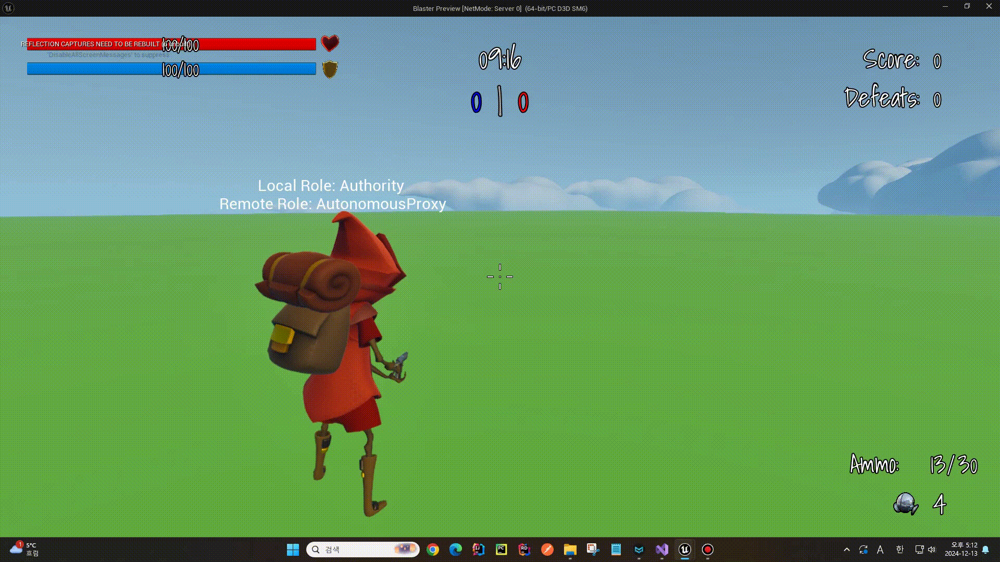
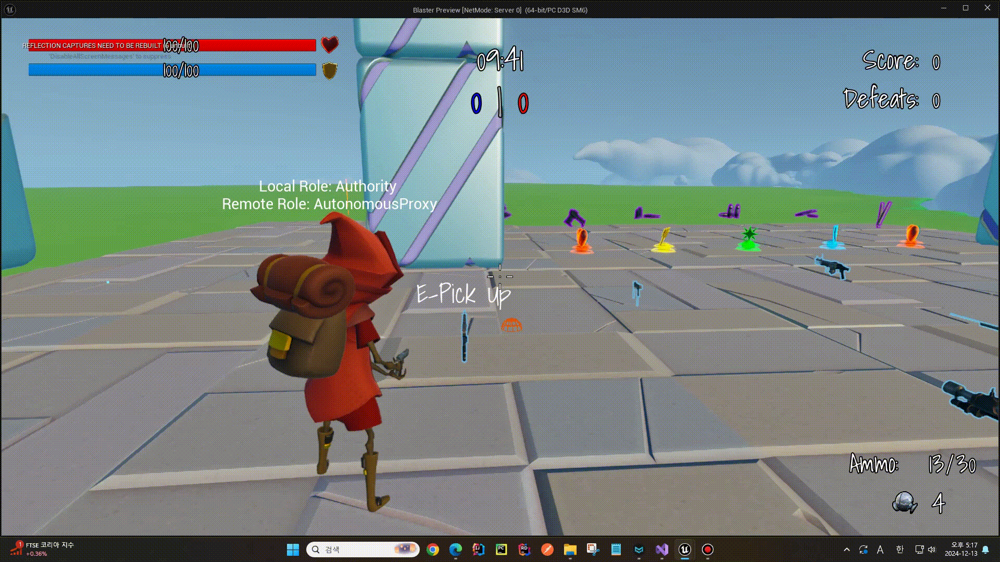
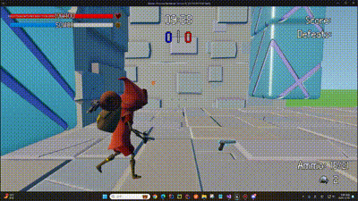
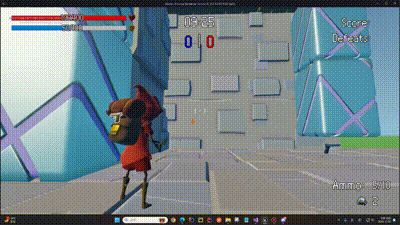
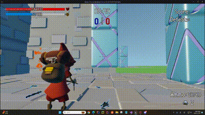
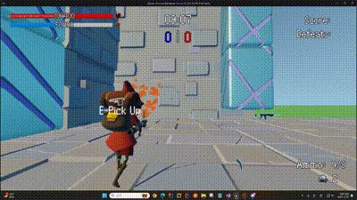
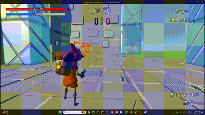
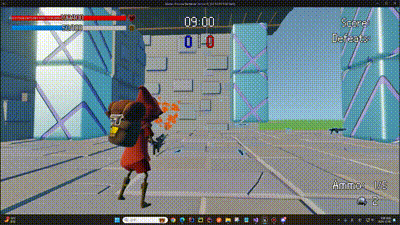

# Blaster (개인)

## 프로젝트 설명

멀티플레이어 슈팅 게임으로, Unreal Engine과 C++를 활용했으며, 리슨서버를 통해 구현되었습니다.

## 기능 소개

##### 기본 동작

|  |              |
|:---------------------------------------:|:-------------------------------------------------:|
| 기본 동작                                   | 움크리기                                              |
|        |  |
| 점프                                      | 자연스러운 시선 처리                                       |

##### 피격 처리

|  |  |
|:-----------------------------------------:|:---------------------------------------:|
| 헤드샷                                       | 몸샷                                      |

##### 무기 줍기 및 변경

|  |  |  |
|:--------------------------------------------------:|:---------------------------------------:|:----------------------------------------------------------------------------:|
| 무기 근접 시 상호작용                                       | 무기 줍기                                   | 무기 변경                                                                        |

##### 무기별 탄약 관리

|  |
|:-----------------------------------------------:|
| 무기별 탄약 관리                                       |

##### 줌 처리

|  |
|:-------------------------------------:|
| 줌 처리                                  |

##### 마우스 위치에 따른 행동

|  |  |
|:----------------------------------------------------------------------------------------------------------:| ------------------------------------------------------------------------------------------------------------------------ |
| 마우스 위치에 따른 기울기                                                                                             | Aimoffset을 통한 바라보는 방향 조정                                                                                                 |

##### 다양한 무기

|  |        |    |
|:-------------------------------------:|:---------------------------------------:|:-------------------------------------:|
| 돌격 소총                                 | 샷건                                      | SMG                                   |
|    |  |  |
| 바주카                                   | 유탄 발사기                                  | 스나이퍼                                  |

##### FABRIK IK를 통한 무기별 손 위치 조정

|  |                                         |
|:----------------------------------------------------------------------------------:|:----------------------------------------------------------------------------------:|
| 돌격 소총 손위치                                                                          | 권총 손위치                                                                             |
|                                       |  |
| 바주카 손위치                                                                            | 스나이퍼 손위치                                                                           |

##### 수류탄

|  |
|:-----------------------------------------:|
| 수류탄 투척                                    |

##### 다양한 버프

|  |  |
|:---------------------------------------:|:---------------------------------------:|
| 체력                                      | 실드                                      |
|  |  |
| 이속                                      | 점프                                      |

##### SSR를 통한 핑문제 해결

|  |  |
|:---------------------------------------------:|:-------------------------------------------:|
| 핑 문제 해결 전                                     | 핑 문제 해결 후                                   |
